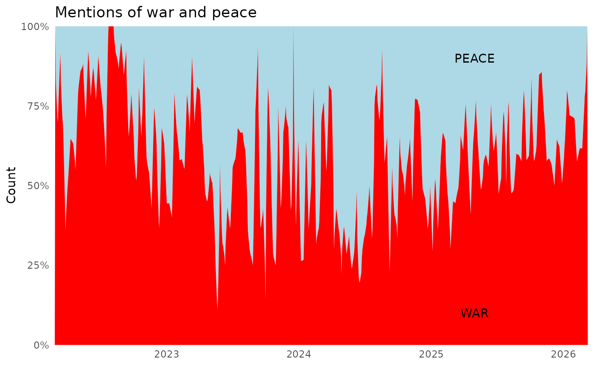
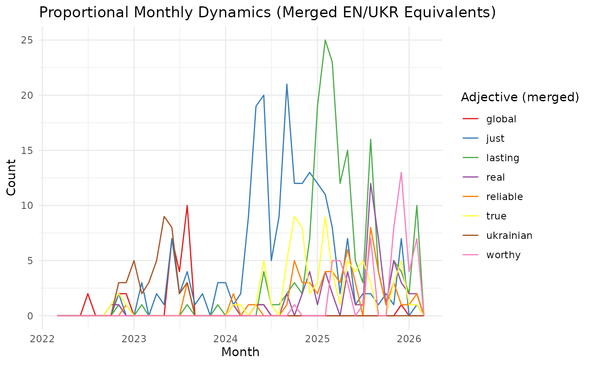
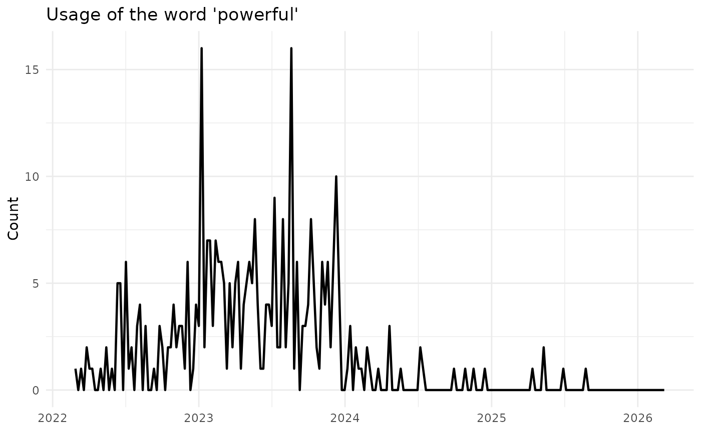

# Studying Zelenskiy / Official: War, Peace, and Language

## Goal

We study:

1.  How often the channel mentions **war** and **peace** over time.
2.  Which adjectives are used to describe **peace** (word before
    “peace”).
3.  The dynamics of the word **“powerful.”**

## Setup

``` r
library(telegramR)
library(dplyr)
library(stringr)
library(lubridate)
library(tidyr)
library(ggplot2)

# your 
api_id <- 123456
api_hash <- "0123456789abcdef0123456789abcdef"

client <- TelegramClient$new("my_session", api_id, api_hash)
client$connect()
```

If not authorized:

``` r
client$send_code_request("your_phone_number")
```

After recieving code in Telegram app:

``` r
client$sign_in(phone = "your_phone_number", code = "code")
```

## Download Messages

You can download a fixed number of recent posts or the full history.

``` r
msgs <- download_channel_messages(
  client,
  "V_Zelenskiy_official",
  start_date = "2022-01-01",
  limit = Inf
)
```

``` r
head(msgs)
#> # A tibble: 6 × 18
#>   message_id channel_id channel_username channel_title date                text 
#>        <dbl>      <dbl> <chr>            <chr>         <dttm>              <chr>
#> 1      18175 1463721328 V_Zelenskiy_off… Zelenskiy / … 2026-03-05 08:38:24 "Чом…
#> 2      18174 1463721328 V_Zelenskiy_off… Zelenskiy / … 2026-03-05 08:33:58 "Нас…
#> 3      18173 1463721328 V_Zelenskiy_off… Zelenskiy / … 2026-03-05 08:23:36 "На …
#> 4      18172 1463721328 V_Zelenskiy_off… Zelenskiy / … 2026-03-05 08:16:00 "У н…
#> 5      18171 1463721328 V_Zelenskiy_off… Zelenskiy / … 2026-03-05 08:06:47 "У в…
#> 6      18170 1463721328 V_Zelenskiy_off… Zelenskiy / … 2026-03-04 20:01:55 "Tod…
#> # ℹ 12 more variables: views <dbl>, forwards <dbl>, replies <dbl>,
#> #   reactions_total <dbl>, reactions_json <chr>, media_type <chr>,
#> #   is_forward <lgl>, forward_from_id <dbl>, forward_from_name <chr>,
#> #   reply_to_msg_id <dbl>, edit_date <dttm>, post_author <chr>
```

## Optional: Reactions and Replies

``` r
# Reactions per post
reactions <- download_channel_reactions(
  client,
  "V_Zelenskiy_official",
  limit = 1000
)

# Replies to the latest 50 posts (if comments are enabled)
replies <- download_channel_replies(
  client,
  "V_Zelenskiy_official",
  message_limit = 50,
  reply_limit = Inf
)
```

## Preprocess

``` r
msgs <- msgs %>%
  filter(!is.na(text)) %>%
  mutate(
    day = as.Date(date),
    text_lower = str_to_lower(text)
  )
```

## 1) War vs. Peace Over Time (weekly dynamics)

``` r
# Count mentions per day (simple word match)
war_peace <- msgs %>%
  mutate(
    war_mentions = str_count(text_lower, "\\bwar\\b") + str_count(text_lower, "\\bвійн.(.||)\\b"),
    peace_mentions = str_count(text_lower, "\\bpeace\\b") + str_count(text_lower, "\\bмир(.||)(.||)\\b")
  ) %>%
  mutate(day = lubridate::round_date(day, unit = "week")) %>% 
  group_by(day) %>%
  summarise(
    war = sum(war_mentions, na.rm = TRUE),
    peace = sum(peace_mentions, na.rm = TRUE),
    .groups = "drop"
  ) %>%
  pivot_longer(cols = c(war, peace), names_to = "term", values_to = "count")

# Plot (guard against empty/NA dates)
if (nrow(war_peace) > 0 && all(!is.na(war_peace$day))) {
  war_peace %>%
    ggplot(aes(day, count, fill = term, group=term)) +
    geom_area(position = "fill") +
    labs(title = "Mentions of war and peace", x = NULL, y = "Count") +
    scale_x_date(expand = c(0, 0, 0, 0)) +
    scale_y_continuous(expand = c(0, 0, 0, 0), labels = scales::percent) +
    scale_fill_manual(values = c("lightblue", "red")) +
    annotate("text", x = ymd("2025-05-01"), y = 0.9, label = "PEACE") +
    annotate("text", x = ymd("2025-05-01"), y = 0.1, label = "WAR") +
    theme_minimal() +
    theme(legend.position = "none")
} else {
  tibble::tibble()
}
```



### Example Output (Bundled Sample)

``` r
library(dplyr)
library(stringr)
library(lubridate)
library(tidyr)

msgs <- msgs_sample %>%
  filter(!is.na(text)) %>%
  mutate(
    day = as.Date(date),
    text_lower = str_to_lower(text)
  )

war_peace <- msgs %>%
  mutate(
    war_mentions = str_count(text_lower, "\\bwar\\b"),
    peace_mentions = str_count(text_lower, "\\bpeace\\b")
  ) %>%
  group_by(day) %>%
  summarise(
    war = sum(war_mentions, na.rm = TRUE),
    peace = sum(peace_mentions, na.rm = TRUE),
    .groups = "drop"
  ) %>%
  pivot_longer(cols = c(war, peace), names_to = "term", values_to = "count")

if (nrow(war_peace) == 0 || any(is.na(war_peace$day))) {
  tibble::tibble()
} else {
  war_peace
}
#> # A tibble: 2,942 × 3
#>    day        term  count
#>    <date>     <chr> <int>
#>  1 2022-02-24 war       0
#>  2 2022-02-24 peace     0
#>  3 2022-02-25 war       0
#>  4 2022-02-25 peace     0
#>  5 2022-02-26 war       0
#>  6 2022-02-26 peace     0
#>  7 2022-02-27 war       0
#>  8 2022-02-27 peace     0
#>  9 2022-02-28 war       0
#> 10 2022-02-28 peace     0
#> # ℹ 2,932 more rows
```

## 2) Adjectives Before “Peace”

We extract the token immediately preceding “peace”.

``` r
# =========================
# Peace/Mир adjective mining + stopword filtering + EN/UKR unification + monthly dynamics
# =========================

# ---- packages ----
library(dplyr)
library(tidyr)
library(stringr)
library(stringi)
library(lubridate)
library(ggplot2)
library(scales)
library(stopwords)
library(RColorBrewer)

# ---- stopwords: EN + UK (ISO) ----
stop_en <- stopwords("en", source = "snowball")
stop_uk <- stopwords("uk", source = "stopwords-iso")
all_stops <- unique(c(stop_en, stop_uk)) %>% str_to_lower()

# ---- ensure we have text_lower + normalized text ----
# If text_lower already exists in msgs, it will be used; otherwise uses `text`.
msgs2 <- msgs %>%
  mutate(
    text_lower = if ("text_lower" %in% names(.)) text_lower else str_to_lower(text),
    text_norm  = stringi::stri_trans_nfc(text_lower)
  )

# ---- ensure we have a parsed datetime column called `date` ----
# Tries common column names; adjust if needed.
date_col <- intersect(c("date", "created_at", "timestamp", "datetime", "time"), names(msgs2))[1]
if (is.na(date_col)) stop("No date column found. Add/rename a date column (e.g., date, created_at, timestamp).")

msgs2 <- msgs2 %>%
  mutate(
    date = .data[[date_col]],
    date = case_when(
      inherits(date, "POSIXt") ~ as.POSIXct(date),
      inherits(date, "Date")  ~ as.POSIXct(date),
      TRUE ~ suppressWarnings(lubridate::ymd_hms(date, quiet = TRUE))
    ),
    date = ifelse(is.na(date), suppressWarnings(lubridate::ymd(.data[[date_col]], quiet = TRUE)), date),
    date = as.POSIXct(date, origin = "1970-01-01")
  )
```

    #> Warning: There was 1 warning in `mutate()`.
    #> ℹ In argument: `date = case_when(...)`.
    #> Caused by warning:
    #> ! Calling `case_when()` with size 1 LHS inputs and size >1 RHS inputs was
    #>   deprecated in dplyr 1.2.0.
    #> ℹ This `case_when()` statement can result in subtle silent bugs and is very inefficient.
    #> 
    #>   Please use a series of if statements instead:
    #> 
    #>   ```
    #>   # Previously
    #>   case_when(scalar_lhs1 ~ rhs1, scalar_lhs2 ~ rhs2, .default = default)
    #> 
    #>   # Now
    #>   if (scalar_lhs1) {
    #>     rhs1
    #>   } else if (scalar_lhs2) {
    #>     rhs2
    #>   } else {
    #>     default
    #>   }
    #>   ```

``` r

# ---- extract the word immediately before peace|мир (row-level, long) ----
adj_long <- msgs2 %>%
  mutate(
    adj = stringi::stri_extract_all_regex(
      text_norm,
      # safer than \\b for Unicode: grab letters preceded by non-letter, followed by peace/мир
      "(?<!\\p{L})(\\p{L}+(?:[\\-–—]\\p{L}+)*)(?=\\s+[\"'«»„“”’)]*\\s*(?:peace|мир(?:у|ом|і|и|ів|ам|ами|ах)?)\\b)"
    )
  ) %>%
  tidyr::unnest_longer(adj) %>%
  mutate(
    adj = str_to_lower(stringi::stri_trans_nfc(adj))
  ) %>%
  filter(!is.na(adj), adj != "", !(adj %in% all_stops))

# ---- unify EN <-> UKR equivalents (add Ukrainian where missing) ----
# Canonical labels = Ukrainian forms (where possible)
equiv_map <- c(

  # =====================
  # REAL — реальний
  # =====================
  "real" = "real",
  "реальний"="real","реального"="real","реальному"="real","реальним"="real",
  "реальним"="real","реальні"="real","реальна"="real","реальну"="real",
  "реальною"="real","реальне"="real","реальних"="real","реальними"="real",

  # =====================
  # LASTING — тривалий
  # =====================
  "lasting"="lasting",
  "тривалий"="lasting","тривалого"="lasting","тривалому"="lasting",
  "тривалим"="lasting","тривалі"="lasting","тривала"="lasting",
  "тривалу"="lasting","тривалою"="lasting","тривале"="lasting",
  "тривалих"="lasting","тривалими"="lasting",

  # =====================
  # GLOBAL — глобальний
  # =====================
  "global"="global",
  "глобальний"="global","глобального"="global","глобальному"="global",
  "глобальним"="global","глобальні"="global","глобальна"="global",
  "глобальну"="global","глобальною"="global","глобальне"="global",
  "глобальних"="global","глобальними"="global",

  # =====================
  # UKRAINIAN — український
  # =====================
  "ukrainian"="ukrainian",
  "український"="ukrainian","українського"="ukrainian","українському"="ukrainian",
  "українським"="ukrainian","українські"="ukrainian","українська"="ukrainian",
  "українську"="ukrainian","українською"="ukrainian","українське"="ukrainian",
  "українських"="ukrainian","українськими"="ukrainian",

  # =====================
  # JUST — справедливий
  # =====================
  "just"="just",
  "справедливий"="just","справедливого"="just","справедливому"="just",
  "справедливим"="just","справедливі"="just","справедлива"="just",
  "справедливу"="just","справедливою"="just","справедливе"="just",
  "справедливих"="just","справедливими"="just",

  # =====================
  # TRUE — справжній
  # =====================
  "true"="true",
  "справжній"="true","справжнього"="true","справжньому"="true",
  "справжнім"="true","справжні"="true","справжня"="true",
  "справжню"="true","справжньою"="true","справжнє"="true",
  "справжніх"="true","справжніми"="true",

  # =====================
  # RELIABLE — надійний
  # =====================
  "reliable"="reliable",
  "надійний"="reliable","надійного"="reliable","надійному"="reliable",
  "надійним"="reliable","надійні"="reliable","надійна"="reliable",
  "надійну"="reliable","надійною"="reliable","надійне"="reliable",
  "надійних"="reliable","надійними"="reliable",

  # =====================
  # WORTHY — достойний
  # =====================
  "worthy"="worthy",
  "достойний"="worthy","достойного"="worthy","достойному"="worthy",
  "достойним"="worthy","достойні"="worthy","достойна"="worthy",
  "достойну"="worthy","достойною"="worthy","достойне"="worthy",
  "достойних"="worthy","достойними"="worthy"
)

adj_long2 <- adj_long %>%
  mutate(
    adj_group = recode(adj, !!!equiv_map, .default = adj)
  )

# ---- overall counts (merged) ----
peace_adjectives_merged <- adj_long2 %>%
  count(adj_group, sort = TRUE)

# show top results
peace_adjectives_merged %>%
  filter(n >= 5) %>%
  head(20)
#> # A tibble: 20 × 2
#>    adj_group      n
#>    <chr>      <int>
#>  1 формули      226
#>  2 just         210
#>  3 lasting      169
#>  4 до           155
#>  5 саміту       151
#>  6 заради        82
#>  7 true          81
#>  8 reliable      62
#>  9 real          58
#> 10 саміті        55
#> 11 worthy        54
#> 12 саміт         51
#> 13 формулу       49
#> 14 ukrainian     43
#> 15 наближення    40
#> 16 формула       38
#> 17 досягнення    31
#> 18 global        30
#> 19 для           30
#> 20 наблизити     29

# ---- monthly dynamics (merged) ----
target_groups <- unique(equiv_map)

monthly_adj_merged <- adj_long2 %>%
  mutate(month = round_date(date, "month")) %>%
  filter(adj_group %in% target_groups) %>%
  count(month, adj_group) %>%
  arrange(month)
```

``` r
# ---- plot: proportional stacked area (100%) with ColorBrewer ----

# full month sequence
all_months <- seq.Date(
  floor_date(min(adj_long2$date, na.rm = TRUE), "month"),
  floor_date(max(adj_long2$date, na.rm = TRUE), "month"),
  by = "1 month"
)

monthly_adj_merged <- adj_long2 %>%
  mutate(month = floor_date(date, "month")) %>%
  filter(adj_group %in% target_groups) %>%
  count(month, adj_group) %>%
  complete(
    month = all_months,
    adj_group = target_groups,
    fill = list(n = 0)
  ) %>%
  arrange(month)

ggplot(monthly_adj_merged, aes(x = month, y = n, color = adj_group, group = adj_group)) +
  geom_path() +
  scale_y_continuous() +
  scale_color_brewer(palette = "Set1") +   # You can change palette here
  labs(
    title = "Proportional Monthly Dynamics (Merged EN/UKR Equivalents)",
    x = "Month",
    y = "Count",
    color = "Adjective (merged)"
  ) +
  theme_minimal()
```



## 3) “Powerful” Over Time

``` r
powerful <- msgs %>%
  mutate(powerful_mentions = str_count(text_lower, "\\bpowerful\\b") + str_count(text_lower, "\\bпотужн.(|.)\\b")) %>%
  mutate(day = lubridate::round_date(day, unit = "week")) %>% 
  group_by(day) %>%
  summarise(powerful = sum(powerful_mentions, na.rm = TRUE), .groups = "drop")

powerful %>%
  ggplot(aes(day, powerful)) +
  geom_line(linewidth = 0.8) +
  labs(title = "Usage of the word 'powerful'", x = NULL, y = "Count") +
  theme_minimal()
```


